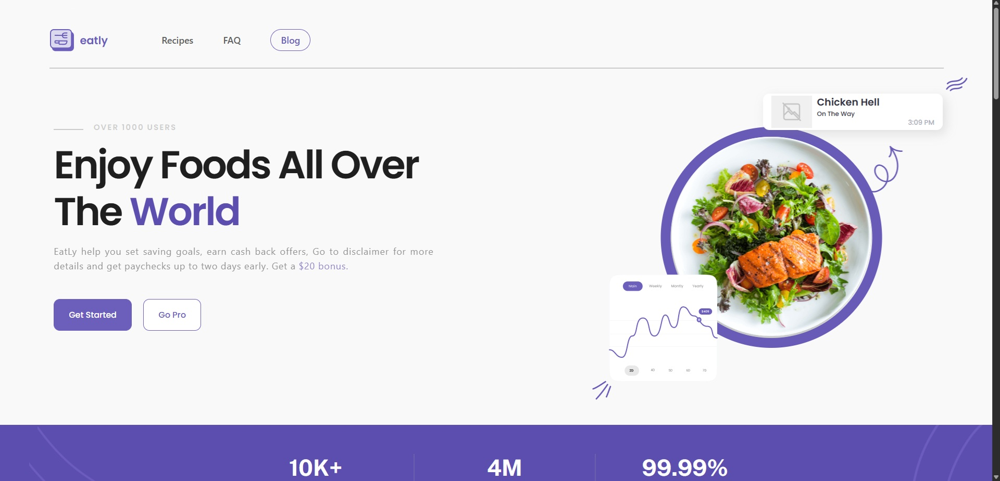
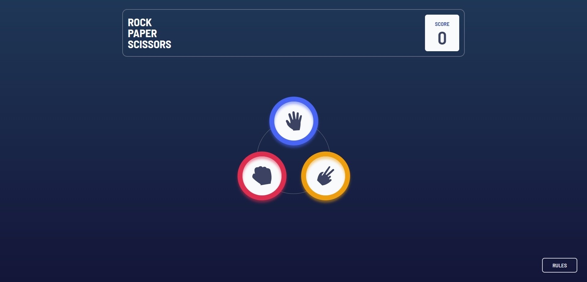
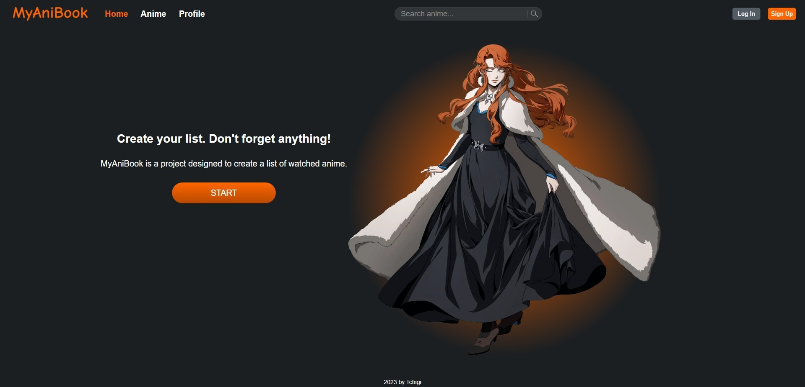
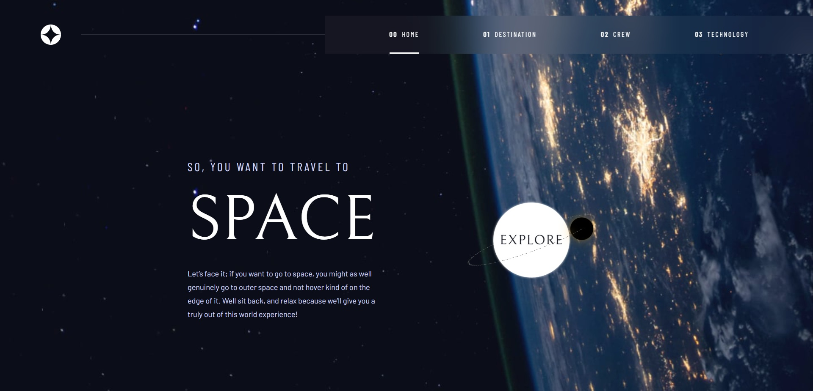

# Ilya / Frontend Developer

Пишу на React + TypeScript, иногда покрываю и бэкенд. Также есть опыт в аналитике данных: Python, SQL, ETL.

---

### 🛠 Stack

**+ из аналитики:** Python · PostgreSQL · ClickHouse · Apache Airflow · Apache Superset

---

### 🚀 Projects

<table>
  <tr>
    <td width="50%" valign="top">
       
      
      <h3>Eatly &nbsp;🍽️&nbsp;</h3>
      Food-сервис с тестами и документацией компонентов.  
      <a href="https://github.com/tchigi/eatly">repo</a> · <a href="https://eatly-tchigi.vercel.app/">demo</a> 
      <code>React 18</code> <code>TypeScript</code> <code>Redux Toolkit</code> <code>Vitest</code> <code>CSS Modules</code> <code>Storybook</code>
        
    </td>
    <td width="50%" valign="top">
       
      
      <h3>Rock Paper Scissors &nbsp;✂️&nbsp;</h3>
      Браузерная игра камень-ножницы-бумага.  
      <a href="https://github.com/tchigi/rock-paper-scissors">repo</a> · <a href="https://rock-paper-scissors-tchigi.vercel.app/">demo</a> 
      <code>React</code> <code>TypeScript</code> <code>Tailwind</code> <code>Zustand</code>
        
    </td>
  </tr>
  <tr>
    <td width="50%" valign="top">
       
      
      <h3>MyAniBook 📚</h3>
      Fullstack-приложение для ведения личного списка аниме.  
      Frontend: <a href="https://github.com/tchigi/myanibook">repo</a> · <a href="https://myanibook.vercel.app/">demo</a> 
      <code>React 18</code> <code>TypeScript</code> <code>Redux Toolkit</code> <code>Styled Components</code>  
      Backend: <a href="https://github.com/tchigi/myanibook-api">repo</a> · <a href="https://myanibook-api.onrender.com/api/docs">demo</a> 
      <code>NestJS</code> <code>PostgreSQL</code> <code>Sequelize</code> <code>Docker</code> <code>Swagger</code> <code>JWT</code>
        
    </td>
    <td width="50%" valign="top">
       
      
      <h3>Space Tourism &nbsp;🚀&nbsp;</h3>
      Сайт туристического агентства по дизайн-макету.  
      <a href="https://github.com/tchigi/space-tourism">repo</a> · <a href="https://space-tourism-seven-flame.vercel.app/">demo</a> 
      <code>Next.js</code> <code>TypeScript</code> <code>CSS Modules</code>
        
    </td>
  </tr>
</table>
